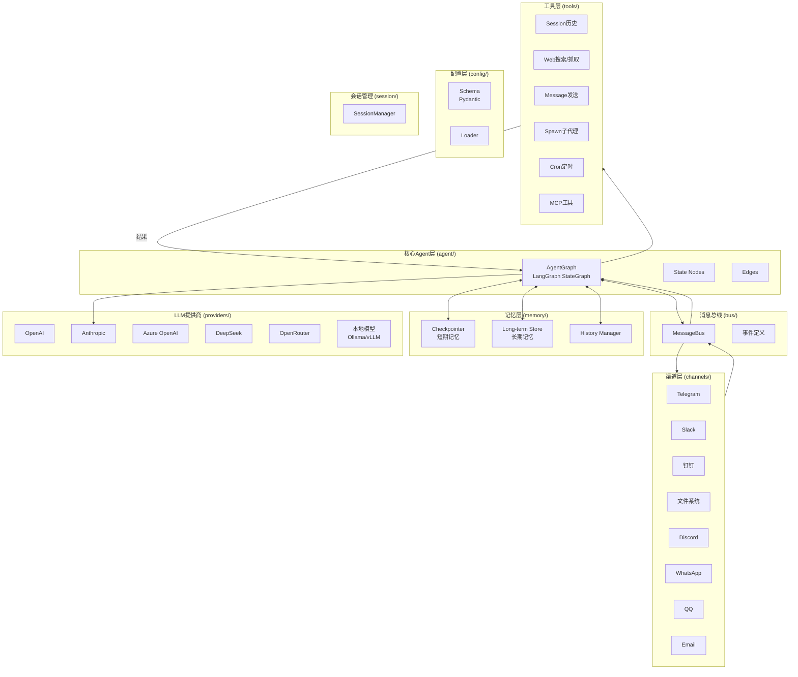
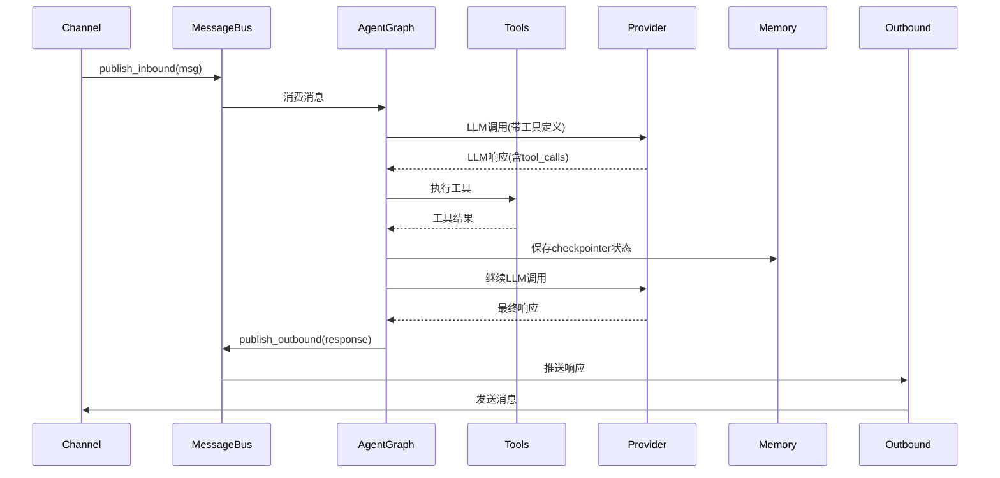
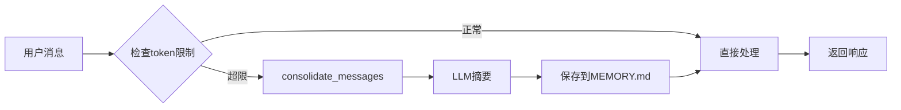

# Lanobot 架构设计文档

## 1. 整体架构



## 2. 模块职责

### 2.1 渠道层 (channels/)

**职责**：对接各种IM/通讯平台的API，统一消息格式

**保留原因**：与业务无关，纯粹适配外部接口

```python
# channels/base.py
class ChannelAdapter(ABC):
    """渠道适配器基类"""

    @abstractmethod
    async def start(self):
        """启动渠道监听"""

    @abstractmethod
    async def send(self, chat_id: str, content: str, metadata: dict = None):
        """发送消息"""

    @abstractmethod
    async def stop(self):
        """停止渠道"""
```

**支持的渠道**：
- Telegram, Slack, Discord
- 钉钉, 飞书, 企业微信
- WhatsApp, QQ, Email, Matrix

### 2.2 消息总线 (bus/)

**职责**：异步消息队列，解耦各模块

**保留原因**：架构清晰，状态无关

```python
# bus/queue.py
class MessageBus:
    """Async message queue for decoupled channel-agent communication"""

    def __init__(self):
        self.inbound: asyncio.Queue[InboundMessage] = asyncio.Queue()
        self.outbound: asyncio.Queue[OutboundMessage] = asyncio.Queue()

    async def publish_inbound(self, msg: InboundMessage):
        await self.inbound.put(msg)

    async def consume_inbound(self) -> InboundMessage:
        return await self.inbound.get()

    async def publish_outbound(self, msg: OutboundMessage):
        await self.outbound.put(msg)
```

### 2.3 Agent核心层 (agent/) - LangChain 1.x重构

**职责**：Agent推理循环，工具调用协调

**重构方案**：使用LangChain 1.x的 `create_agent` API（基于LangGraph）

> ⚠️ **重要更新**: LangGraph v1 废弃了 `create_react_agent`，推荐使用 LangChain 1.x 的 `create_agent`

```python
# agent/graph.py
from langchain.agents import create_agent
from langgraph.checkpoint.memory import InMemorySaver

class AgentGraph:
    """LangChain 1.x Agent构建器"""

    def __init__(self, model, tools: list, checkpointer=None, middleware=None):
        self.graph = create_agent(
            model,                      # 模型实例或模型名
            tools,                      # 工具列表
            system_prompt="你是lanobot，一个超轻量级AI助手。",  # 注意：不再是prompt
            checkpointer=checkpointer,
            middleware=middleware,      # 可选：中间件列表
        )

    async def invoke(self, message: str, thread_id: str):
        config = {"configurable": {"thread_id": thread_id}}
        return await self.graph.ainvoke(
            {"messages": [{"role": "user", "content": message}]},
            config=config
        )
```

#### Middleware系统

```python
# agent/middleware.py
from langchain.agents.middleware import HumanInTheLoopMiddleware

# 人机协作中间件 - 敏感操作需要审批
human_middleware = HumanInTheLoopMiddleware(
    interrupt_on={
        "send_message": True,    # 发送消息需要审批
        "exec_command": True,    # 执行命令需要审批
        "write_file": True,      # 写文件需要审批
    }
)

# 创建带中间件的Agent
agent = create_agent(
    model,
    tools,
    system_prompt="...",
    middleware=[human_middleware],
    checkpointer=InMemorySaver(),
)
```

### 2.4 工具层 (tools/) - LangChain化

**职责**：Agent可调用的外部能力

**重构方案**：使用`@tool`装饰器或`StructuredTool`

```python
# tools/filesystem.py
from langchain_core.tools import tool, StructuredTool
from pydantic import BaseModel, Field

# 方式1：使用@tool装饰器（简单场景）
@tool
def read_file(path: str) -> str:
    """读取文件内容

    Args:
        path: 文件路径（绝对路径或相对于workspace的路径）

    Returns:
        文件内容字符串
    """
    # 实现逻辑
    pass

@tool
def write_file(path: str, content: str) -> str:
    """写入文件内容

    Args:
        path: 文件路径
        content: 要写入的内容
    """
    pass

@tool
def list_directory(path: str = ".") -> str:
    """列出目录内容"""
    pass

@tool
def edit_file(path: str, old: str, new: str) -> str:
    """编辑文件内容（替换指定文本）"""
    pass
```

```python
# tools/shell.py
@tool
def exec_command(command: str, timeout: int = 60) -> str:
    """执行Shell命令

    Args:
        command: 要执行的命令
        timeout: 超时时间（秒），默认60秒
    """
    pass
```

```python
# tools/web.py
@tool
def web_search(query: str, max_results: int = 5) -> str:
    """Web搜索"""
    pass

@tool
def web_fetch(url: str) -> str:
    """抓取网页内容"""
    pass

@tool
def message_send(channel: str, chat_id: str, content: str) -> str:
    """发送消息到指定渠道"""
    pass

@tool
def spawn_subagent(task: str, model: str = None) -> str:
    """Spawn a sub-agent to handle subtasks"""
    pass
```

### 2.5 记忆层 (memory/) - LangChain化

**职责**：短期会话记忆 + 长期记忆

**重构方案**：LangGraph Checkpointer + LangChain Store

> ⚠️ **注意**: LangChain 1.x 使用 `InMemorySaver` 替代了 `MemorySaver`

```python
# memory/checkpointer.py
from langgraph.checkpoint.memory import InMemorySaver

# 开发环境
checkpointer = InMemorySaver()

# 生产环境
# from langgraph.checkpoint.postgres import PostgresSaver
# checkpointer = PostgresSaver.from_conn_string(conn_string)
```

```python
# memory/store.py
from langchain.storage import InMemoryStore
from langgraph.store.postgres import PostgresStore

class MemoryStore:
    """长期记忆存储"""

    def __init__(self, use_postgres: bool = False):
        if use_postgres:
            self.store = PostgresStore.from_conn_string(conn_string)
        else:
            self.store = InMemoryStore()

    async def search_memory(self, query: str, k: int = 5) -> list:
        """语义检索相关记忆"""
        pass

    async def save_memory(self, key: str, value: str, metadata: dict = None):
        """保存记忆"""
        pass
```

### 2.6 Providers层 (providers/)

**职责**：LLM接口适配

**保留原因**：对接各种API，但包装为LangChain接口

```python
# providers/langchain_wrapper.py
from langchain_anthropic import ChatAnthropic
from langchain_openai import ChatOpenAI
from langchain_community.chat_models import ChatLiteLLM

def create_llm(provider: str, model: str, api_key: str = None, api_base: str = None):
    """创建LangChain LLM实例"""

    if provider == "anthropic":
        return ChatAnthropic(
            model=model,
            api_key=api_key,
            base_url=api_base
        )
    elif provider == "openai":
        return ChatOpenAI(
            model=model,
            api_key=api_key,
            base_url=api_base
        )
    # LiteLLM支持所有OpenAI兼容的API
    elif provider == "litellm":
        return ChatLiteLLM(
            model=model,
            api_key=api_key,
            base_url=api_base
        )
```

### 2.7 配置层 (config/)

**职责**：YAML/Env配置解析

**保留**：Pydantic配置系统已经很完善

```python
# config/schema.py
class Config(BaseSettings):
    agents: AgentsConfig
    channels: ChannelsConfig
    providers: ProvidersConfig
    gateway: GatewayConfig
    tools: ToolsConfig
```

### 2.8 会话管理 (session/)

**职责**：会话历史持久化

**保留**：Session管理逻辑与具体Agent实现解耦

```python
# session/manager.py
class SessionManager:
    """会话管理器"""

    def __init__(self, workspace: Path):
        self.sessions_dir = workspace / "sessions"

    def get_or_create(self, session_key: str) -> Session:
        """获取或创建会话"""

    def save(self, session: Session):
        """保存会话"""

    def get_history(self, session_key: str, max_messages: int = None) -> list:
        """获取会话历史"""
```

## 3. 数据流

### 3.1 消息处理流程



### 3.2 记忆系统流程



## 4. 目录结构

```
lanobot/
├── main.py                    # 入口点
├── pyproject.toml             # 项目配置
├── CLAUDE.md                  # Claude Code指导
│
├── config/                    # 配置层
│   ├── schema.py              # Pydantic配置模型
│   ├── loader.py              # 配置加载
│   └── paths.py               # 路径工具
│
├── bus/                       # 消息总线
│   ├── queue.py               # MessageBus实现
│   └── events.py              # 事件定义
│
├── channels/                  # 渠道层（保留）
│   ├── base.py                # 渠道基类
│   ├── manager.py             # 渠道管理
│   ├── telegram.py
│   ├── slack.py
│   ├── feishu.py
│   ├── dingtalk.py
│   ├── discord.py
│   ├── whatsapp.py
│   ├── qq.py
│   ├── wecom.py
│   ├── email.py
│   └── matrix.py
│
├── providers/                 # LLM提供商
│   ├── base.py                # 基础接口（可保留）
│   ├── registry.py            # 提供商注册
│   ├── langchain_wrapper.py   # LangChain包装器
│   ├── openai_provider.py
│   ├── anthropic_provider.py
│   ├── azure_openai_provider.py
│   ├── litellm_provider.py
│   └── custom_provider.py
│
├── agent/                     # Agent核心层（LangChain化）
│   ├── __init__.py
│   ├── state.py               # AgentState定义
│   ├── graph.py               # LangGraph构建
│   ├── nodes.py               # 节点函数
│   ├── edges.py               # 边定义
│   └── middleware.py          # 中间件
│
├── tools/                     # 工具层（LangChain化）
│   ├── __init__.py
│   ├── registry.py            # 工具注册
│   ├── filesystem.py          # 文件操作
│   ├── shell.py               # Shell执行
│   ├── web.py                 # Web工具
│   ├── message.py             # 消息发送
│   ├── spawn.py               # 子代理
│   ├── cron.py                # 定时任务
│   └── mcp.py                 # MCP集成
│
├── memory/                    # 记忆层（LangChain化）
│   ├── checkpointer.py        # LangGraph Checkpointer
│   ├── store.py               # 长期记忆
│   └── history.py             # 历史记录管理
│
├── session/                   # 会话管理
│   ├── __init__.py
│   ├── manager.py             # 会话管理器
│   └── types.py               # 会话类型
│
├── cron/                      # 定时任务
│   ├── service.py
│   └── types.py
│
├── heartbeat/                 # 心跳服务
│   └── service.py
│
├── cli/                       # CLI命令
│   ├── commands.py
│   └── __init__.py
│
└── utils/                     # 工具函数
    └── helpers.py
```

## 5. 重构计划

### Phase 1: 基础架构
- [ ] 创建agent/state.py - AgentState定义
- [ ] 创建agent/graph.py - LangGraph构建
- [ ] 创建providers/langchain_wrapper.py - LLM包装
- [ ] 集成现有MessageBus

### Phase 2: 工具迁移
- [ ] 将tools/filesystem.py转为@tool
- [ ] 将tools/shell.py转为@tool
- [ ] 将tools/web.py转为@tool
- [ ] 集成MCP工具

### Phase 3: 记忆系统
- [ ] 集成LangGraph Checkpointer
- [ ] 实现长期记忆Store
- [ ] 迁移会话历史

### Phase 4: 渠道适配
- [ ] 适配现有渠道到新Agent接口
- [ ] 测试各渠道连通性

### Phase 5: CLI和配置
- [ ] 更新CLI命令
- [ ] 验证配置系统

## 6. 关键设计决策

### 6.1 为什么用混合架构?
- **保留**：渠道、配置、业务无关的模块已经稳定
- **重构**：Agent核心需要LangChain的标准化和生态

### 6.2 LangGraph vs 纯LangChain
- 使用`create_agent`快速构建
- 后续可扩展为自定义StateGraph

### 6.3 记忆策略
- **短期**：LangGraph Checkpointer (thread_id级别)
- **长期**：LangChain Store (跨会话)
- **历史**：文件存储 (可grep搜索)

### 6.4 Provider策略
- 保留原有provider注册机制
- 新增LangChain包装层
- 渐进式迁移