# Lanobot 系统架构分析报告

## 1. 项目概述

### 1.1 项目定位
Lanobot 是一个**超轻量级个人 AI 助手**，基于 LangChain 1.2 和 LangGraph 开发。它采用模块化架构，支持多 LLM 提供商、多渠道接入、工具扩展和记忆管理。

### 1.2 核心特性
- 🤖 **LLM 集成** - 支持 19+ 种 LLM 提供商（SiliconFlow、DeepSeek、OpenAI、Anthropic 等）
- 💬 **多渠道支持** - 飞书、QQ、Telegram、Slack、Discord、钉钉、企业微信、WhatsApp
- 🔌 **MCP 支持** - Model Context Protocol 扩展
- 📡 **消息总线** - 异步消息队列架构
- ⏰ **定时任务** - Cron 定时提醒和任务
- 💓 **心跳服务** - 自动执行周期性任务
- 💾 **会话管理** - 持久化存储、自动摘要、过期清理
- 🧠 **记忆系统** - 短期记忆（Checkpointer）+ 长期记忆（Store）

### 1.3 技术栈
- **LangChain 1.2** - Agent 框架
- **LangGraph** - 状态流和持久化
- **Pydantic V2** - 配置管理
- **Python 3.11+** - 运行环境

---

## 2. 系统架构总览

### 2.1 整体架构图

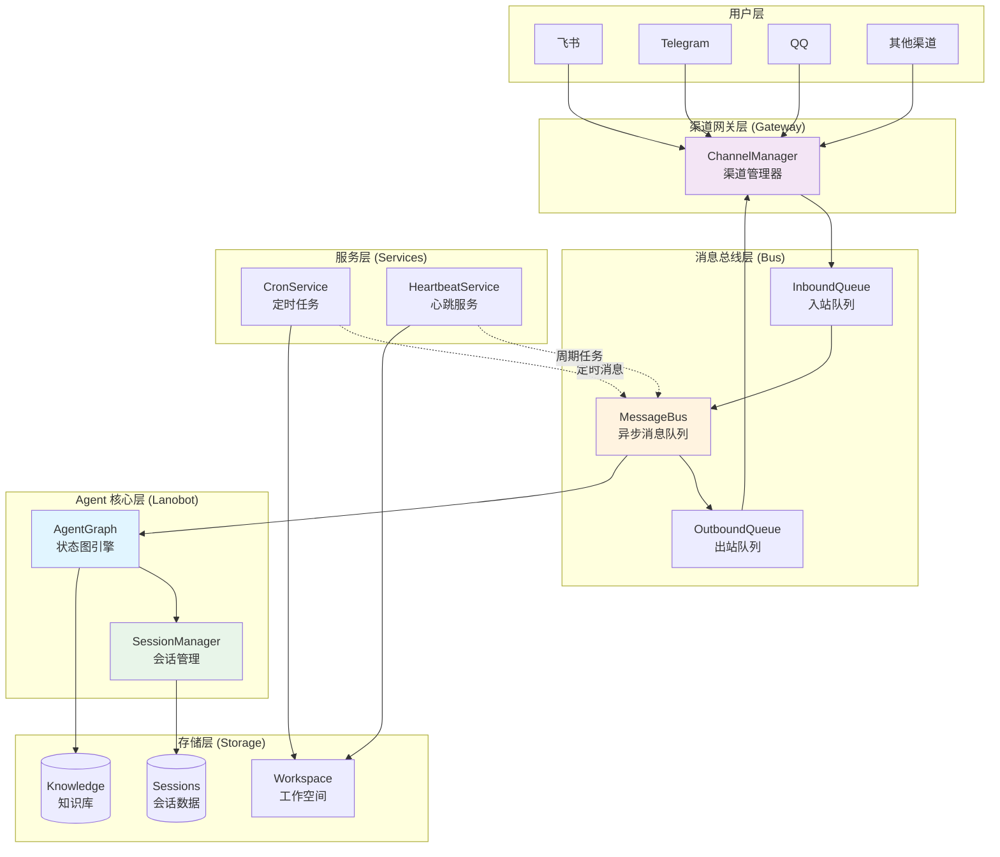

### 2.2 运行模式

Lanobot 支持三种运行模式：

| 模式 | 说明 | 启动命令 | 包含组件 |
|------|------|----------|----------|
| **agent** | 仅 Agent 核心 | `lanobot run agent` | AgentGraph + Tools + Memory |
| **gateway** | 仅渠道网关 | `lanobot run gateway` | ChannelManager + MessageBus |
| **all** | 完整服务 | `lanobot run start` | 所有组件 |

---

## 3. Agent 核心架构

### 3.1 AgentGraph 状态图

AgentGraph 是 Lanobot 的核心，基于 LangGraph StateGraph 构建，实现了一个可扩展的 Agent 执行流程。


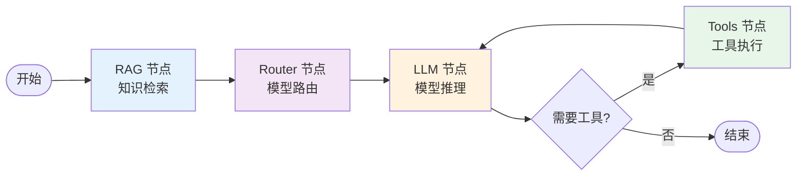

### 3.2 节点详解

#### 3.2.1 RAG 节点（知识检索）
- **功能**：在 LLM 调用前自动检索知识库
- **输入**：用户最新消息
- **输出**：`rag_context`（检索到的上下文）
- **实现**：`lanobot/agent/nodes.py::create_rag_node()`
- **检索器**：`InMemoryRAG`（简单关键词匹配）或自定义向量检索器

#### 3.2.2 Router 节点（模型路由）
- **功能**：根据任务类型自动选择合适的模型
- **路由策略**：
  - 简单问题 → 快速模型（如 Haiku、mini）
  - 复杂问题 → 强力模型（如 Sonnet、Pro）
  - 代码问题 → 代码专用模型
- **输入**：用户消息
- **输出**：`selected_model`（选中的模型实例）
- **实现**：`lanobot/agent/router.py::ModelRouter`

#### 3.2.3 LLM 节点（模型推理）
- **功能**：使用选中的模型执行推理
- **输入**：
  - `messages`（对话历史）
  - `selected_model`（Router 选择的模型）
  - `rag_context`（RAG 检索的上下文）
  - `system_prompt`（系统提示词）
- **输出**：新的 AI 消息（可能包含工具调用）
- **实现**：`lanobot/agent/nodes.py::create_llm_node()`


#### 3.2.4 Tools 节点（工具执行）
- **功能**：执行 LLM 请求的工具调用
- **输入**：`tool_calls`（工具调用列表）
- **输出**：工具执行结果
- **实现**：`langgraph.prebuilt.ToolNode`
- **循环**：执行完工具后返回 LLM 节点继续推理

### 3.3 状态定义

```python
class AgentState(TypedDict):
    messages: Annotated[list[BaseMessage], add_messages]  # 对话历史
    session_id: Optional[str]                              # 会话ID
    user_id: Optional[str]                                 # 用户ID
    context: Optional[dict]                                # 额外上下文
    rag_context: Optional[str]                             # RAG 检索上下文
    selected_model: Optional[Any]                          # Router 选择的模型
    tool_calls: Optional[list[Any]]                        # 工具调用列表
```

### 3.4 执行流程

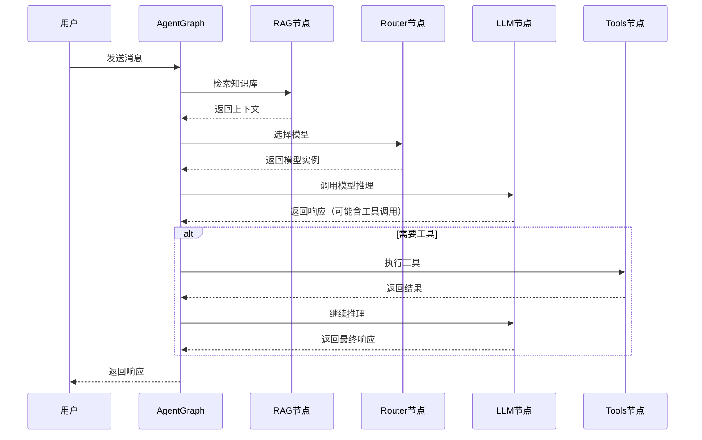

---

## 4. 工具系统

### 4.1 工具注册表架构

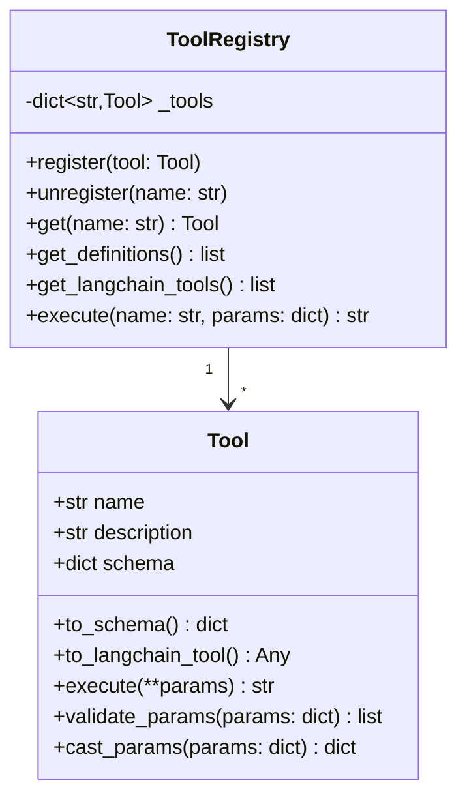


### 4.2 内置工具列表

| 工具名称 | 文件 | 功能 | 关键方法 |
|---------|------|------|---------|
| **filesystem** | `lanobot/tools/filesystem.py` | 文件系统操作 | read_file, write_file, list_dir |
| **shell** | `lanobot/tools/shell.py` | Shell 命令执行 | exec_command |
| **web** | `lanobot/tools/web.py` | 网页抓取 | fetch_url, search_web |
| **message** | `lanobot/tools/message.py` | 消息发送 | send_message |
| **cron** | `lanobot/tools/cron.py` | 定时任务管理 | add_cron, remove_cron |
| **spawn** | `lanobot/tools/spawn.py` | 子 Agent 创建 | spawn_subagent |
| **mcp** | `lanobot/tools/mcp.py` | MCP 协议扩展 | call_mcp_tool |

### 4.3 工具创建流程

```python
# 1. 创建工具注册表
from lanobot.tools import create_tool_registry

registry = create_tool_registry(
    workspace="./workspace",
    include_filesystem=True,
    include_shell=True,
    include_web=False,
    include_message=True,
    include_cron=False,
)

# 2. 获取 LangChain 工具
tools = registry.get_langchain_tools()

# 3. 绑定到 AgentGraph
agent = AgentGraph(model=model, tools=tools)
```

---

## 5. 记忆系统

### 5.1 记忆架构

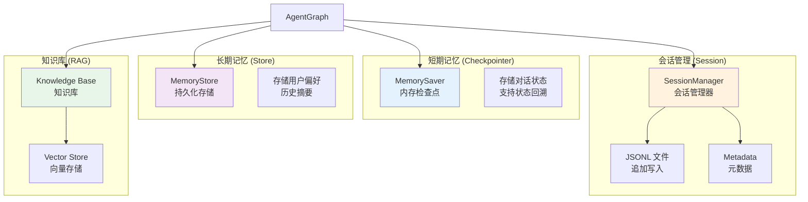


### 5.2 记忆类型对比

| 记忆类型 | 实现 | 存储内容 | 生命周期 | 用途 |
|---------|------|---------|---------|------|
| **短期记忆** | MemorySaver | 对话状态、消息历史 | 会话期间 | 状态持久化、回溯 |
| **长期记忆** | MemoryStore | 用户偏好、历史摘要 | 永久 | 跨会话记忆 |
| **会话管理** | SessionManager | 完整对话记录 | 30天（可配置） | 会话恢复、摘要 |
| **知识库** | RAGNode | 文档、知识片段 | 永久 | 上下文检索 |

### 5.3 会话管理流程

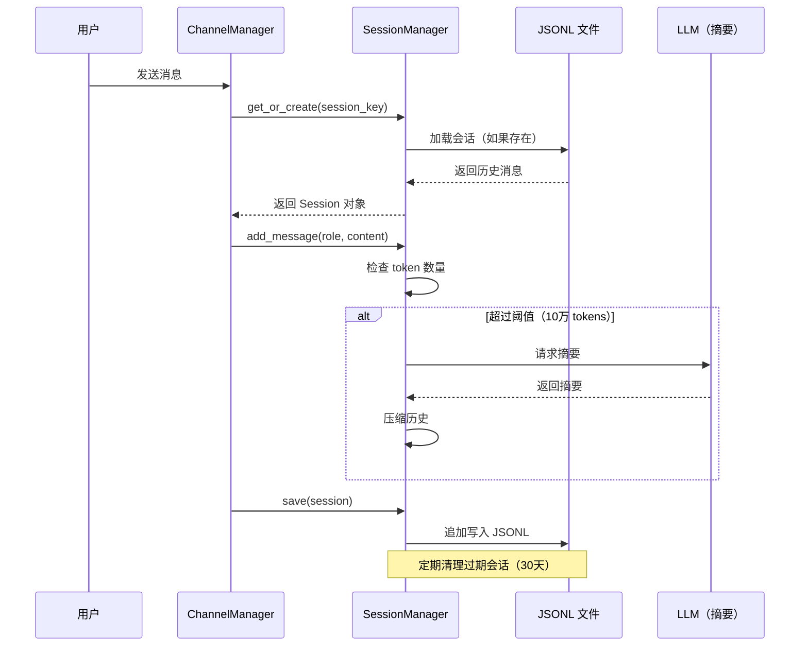

### 5.4 会话压缩策略

- **触发条件**：消息总 token 数超过 10 万
- **压缩方式**：使用 LLM 生成摘要，保留最近 N 条消息
- **保留策略**：
  - 保留系统消息
  - 保留最近 20 条消息
  - 其他消息压缩为摘要

---

## 6. 提供商系统

### 6.1 提供商架构

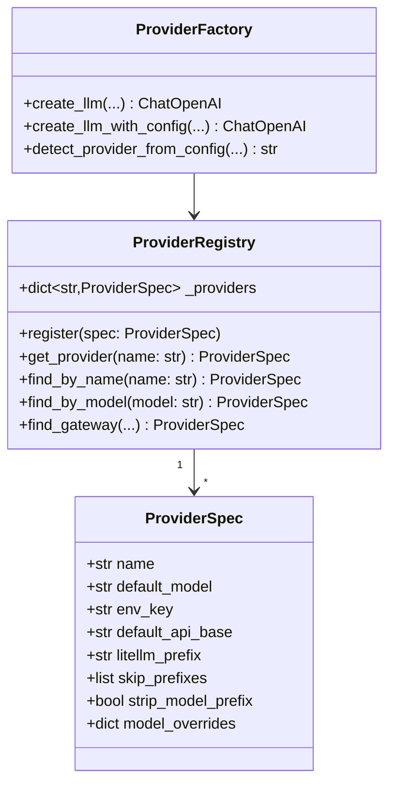


### 6.2 支持的提供商（19+）

| 提供商 | 默认模型 | API Base | 特点 |
|-------|---------|----------|------|
| **SiliconFlow** | Qwen/Qwen2.5-7B-Instruct | api.siliconflow.cn | 国内高性价比 |
| **DeepSeek** | deepseek-chat | api.deepseek.com | 国产强力模型 |
| **OpenAI** | gpt-4o-mini | api.openai.com | 官方 API |
| **Anthropic** | claude-3-5-sonnet-20241022 | api.anthropic.com | Claude 系列 |
| **OpenRouter** | - | openrouter.ai | 聚合网关 |
| **Groq** | llama-3.3-70b-versatile | api.groq.com | 超快推理 |
| **Together** | - | api.together.xyz | 开源模型托管 |
| **Fireworks** | - | api.fireworks.ai | 高性能推理 |
| **Replicate** | - | api.replicate.com | 模型市场 |
| **Cohere** | command-r-plus | api.cohere.ai | 企业级 |
| **AI21** | jamba-1.5-large | api.ai21.com | Jamba 系列 |
| **Mistral** | mistral-large-latest | api.mistral.ai | Mistral 官方 |
| **Perplexity** | llama-3.1-sonar-large-128k-online | api.perplexity.ai | 联网搜索 |
| **Gemini** | gemini-2.0-flash-exp | generativelanguage.googleapis.com | Google 官方 |
| **xAI** | grok-beta | api.x.ai | Grok 系列 |
| **Cerebras** | llama3.1-70b | api.cerebras.ai | 超快推理 |
| **Sambanova** | Meta-Llama-3.1-70B-Instruct | api.sambanova.ai | Llama 优化 |
| **Hyperbolic** | meta-llama/Meta-Llama-3.1-70B-Instruct | api.hyperbolic.xyz | 低成本 |
| **Novita** | meta-llama/llama-3.1-70b-instruct | api.novita.ai | 多模型支持 |

### 6.3 提供商创建流程

```python
from lanobot.providers import create_llm

# 方式1：使用默认配置
llm = create_llm("siliconflow")

# 方式2：指定模型
llm = create_llm("deepseek", model="deepseek-chat")

# 方式3：完整配置
llm = create_llm(
    provider="openai",
    model="gpt-4o",
    api_key="sk-xxx",
    base_url="https://api.openai.com/v1",
    temperature=0.5,
    max_tokens=4096,
    extra_headers={"Custom-Header": "value"},
)
```

---

## 7. 消息总线系统

### 7.1 消息总线架构

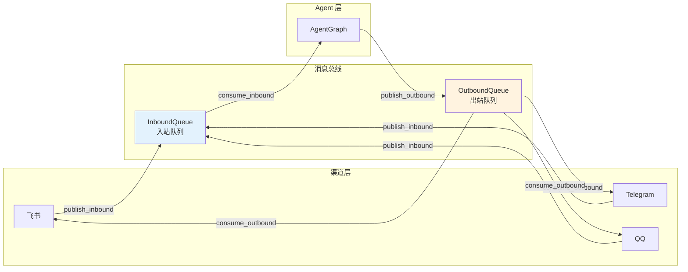


### 7.2 消息类型

```python
# 入站消息（从渠道到 Agent）
class InboundMessage:
    channel: str        # 渠道名称（如 "telegram"）
    chat_id: str        # 聊天ID
    user_id: str        # 用户ID
    content: str        # 消息内容
    timestamp: float    # 时间戳
    metadata: dict      # 额外元数据

# 出站消息（从 Agent 到渠道）
class OutboundMessage:
    channel: str        # 目标渠道
    chat_id: str        # 目标聊天ID
    content: str        # 消息内容
    reply_to: str       # 回复的消息ID（可选）
    metadata: dict      # 额外元数据
```

### 7.3 消息流转流程

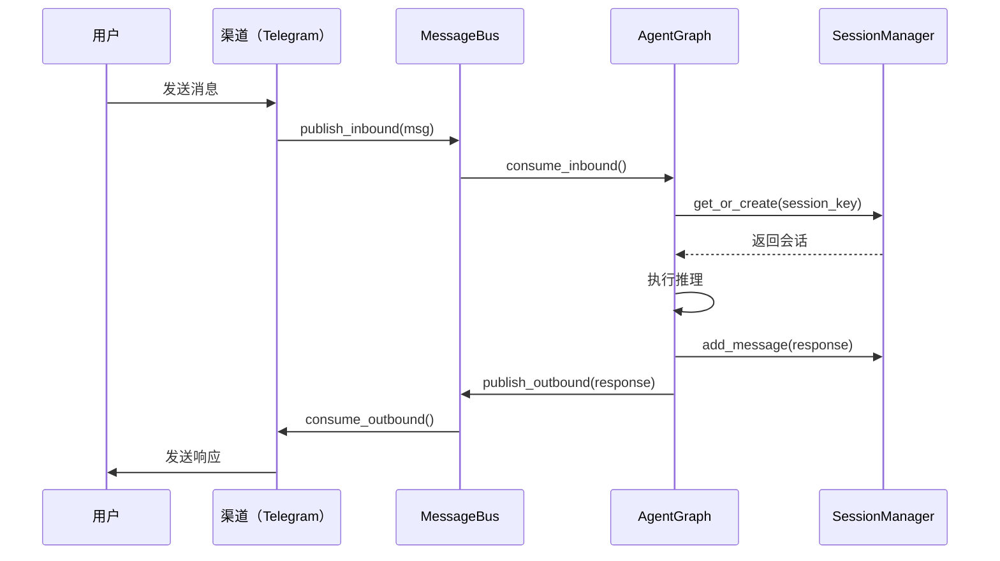

---

## 8. 服务系统

### 8.1 服务架构

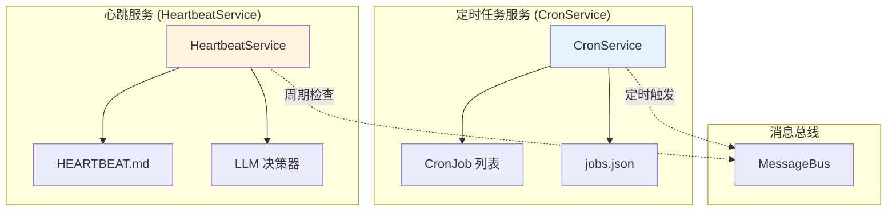

### 8.2 CronService（定时任务）

#### 功能
- 支持 cron 表达式（如 `0 9 * * *`）
- 支持间隔执行（如每 30 分钟）
- 支持一次性任务（at 时间点）
- 持久化存储（JSON 文件）

#### 任务格式
```python
class CronJob:
    id: str                    # 任务ID
    name: str                  # 任务名称
    message: str               # 要发送的消息
    schedule: CronSchedule     # 调度配置
    channel: str               # 目标渠道
    to: str                    # 接收者
    enabled: bool              # 是否启用
    delete_after_run: bool     # 执行后删除
```


#### 调度类型
```python
class CronSchedule:
    kind: str           # "cron" | "every" | "at"
    expr: str           # cron 表达式（kind=cron）
    every_ms: int       # 间隔毫秒（kind=every）
    at_ms: int          # 时间戳（kind=at）
    tz: str             # 时区
```

#### 使用示例
```python
# 每天早上 9 点发送提醒
cron_service.add_job(
    name="每日提醒",
    schedule=CronSchedule(kind="cron", expr="0 9 * * *"),
    message="早上好！今天要做什么？",
    channel="telegram",
    to="user_123",
)

# 每 30 分钟检查一次
cron_service.add_job(
    name="定期检查",
    schedule=CronSchedule(kind="every", every_ms=1800000),  # 30分钟
    message="定期检查任务",
    channel="admin",
    to="system",
)
```

### 8.3 HeartbeatService（心跳服务）

#### 功能
- 定期检查 `HEARTBEAT.md` 文件
- 使用 LLM 决策哪些任务需要执行
- 支持任务标记（完成/未完成）
- 自动更新任务状态

#### HEARTBEAT.md 格式
```markdown
# Heartbeat Tasks

- [ ] 每日总结: 生成今天的工作总结
- [x] 周报生成: 每周五生成周报（已完成）
- [ ] 数据备份: 检查数据库备份状态
```

#### 决策流程
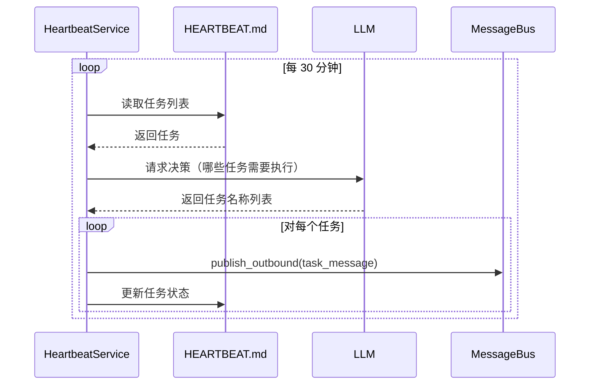

---

## 9. 渠道系统

### 9.1 渠道管理器架构

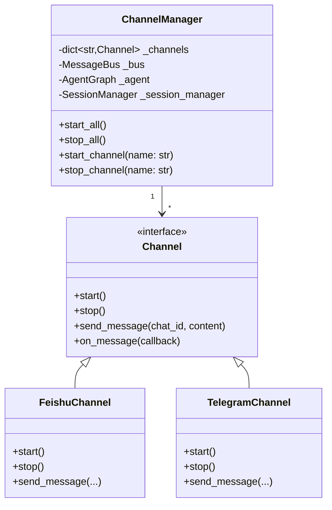


### 9.2 支持的渠道

| 渠道 | 文件 | 状态 | 特点 |
|------|------|------|------|
| **飞书** | `bus/channels/feishu.py` | ✅ | 企业级，支持卡片消息 |
| **Telegram** | `bus/channels/telegram.py` | ✅ | 国际主流，功能丰富 |
| **QQ** | `bus/channels/qq.py` | ✅ | 国内主流 |
| **Slack** | `bus/channels/slack.py` | ✅ | 企业协作 |
| **Discord** | `bus/channels/discord.py` | ✅ | 游戏社区 |
| **钉钉** | `bus/channels/dingtalk.py` | ✅ | 企业办公 |
| **企业微信** | `bus/channels/wechat_work.py` | ✅ | 企业办公 |
| **WhatsApp** | `bus/channels/whatsapp.py` | ✅ | 国际主流 |

### 9.3 渠道消息处理流程

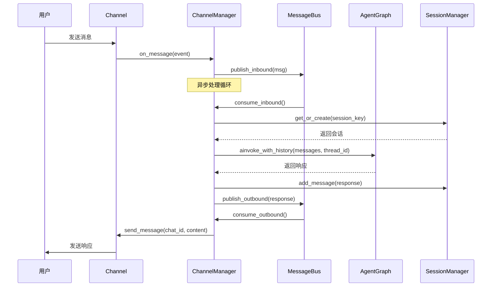

---

## 10. 配置系统

### 10.1 配置架构

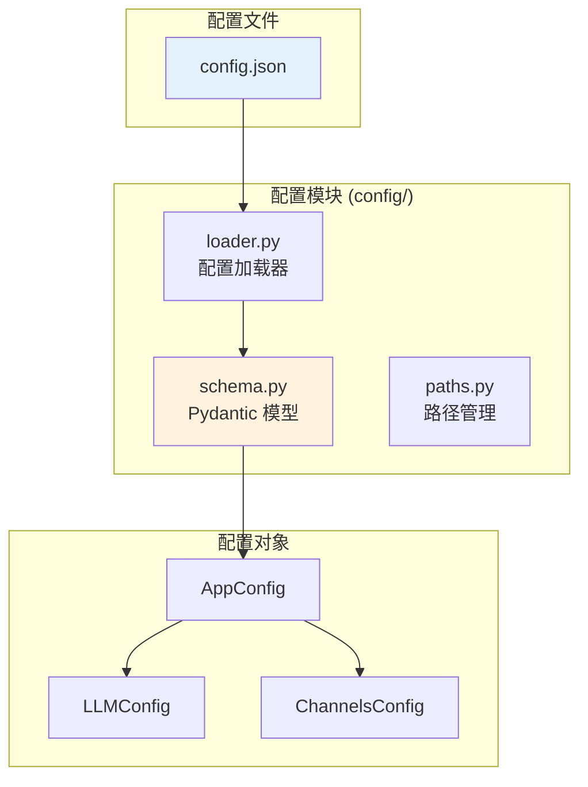

### 10.2 配置结构

```python
class AppConfig:
    version: str                    # 版本号
    llm: LLMConfig                  # LLM 配置
    channels: ChannelsConfig        # 渠道配置
    workspace: str                  # 工作空间路径
    log_level: str                  # 日志级别

class LLMConfig:
    provider: str                   # 提供商名称
    model: str                      # 模型名称
    api_key: str                    # API Key
    base_url: Optional[str]         # API Base URL
    temperature: float              # 温度
    max_tokens: int                 # 最大 tokens

class ChannelsConfig:
    feishu: Optional[FeishuConfig]
    telegram: Optional[TelegramConfig]
    qq: Optional[QQConfig]
    # ... 其他渠道
```


### 10.3 配置加载流程

```python
from config import load_config

# 加载配置（自动从 config.json 读取）
config = load_config()

# 访问配置
print(config.llm.provider)      # "siliconflow"
print(config.llm.model)          # "Qwen/Qwen2.5-7B-Instruct"
print(config.channels.keys())    # ["telegram", "feishu"]
```

---

## 11. 完整数据流

### 11.1 用户消息处理完整流程

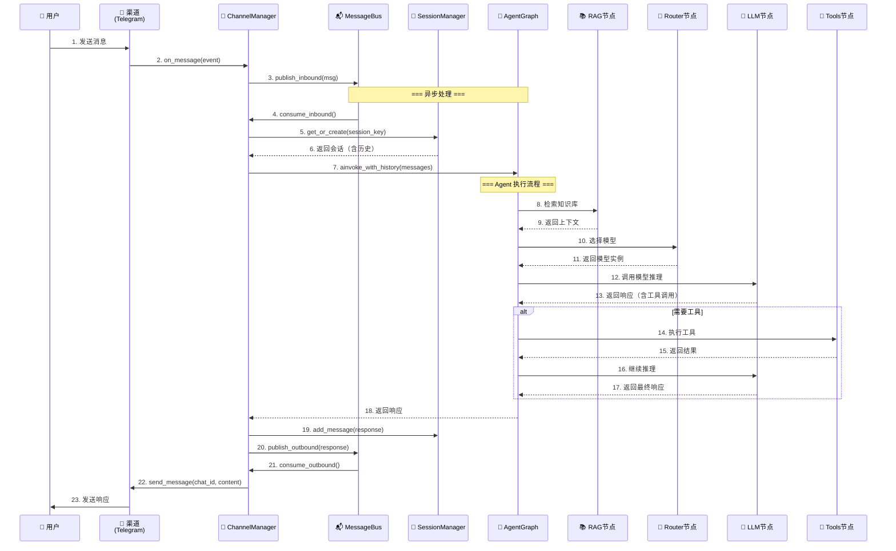

### 11.2 关键路径分析

| 阶段 | 步骤 | 耗时估计 | 优化点 |
|------|------|---------|--------|
| **消息接收** | 1-3 | <10ms | 渠道 SDK 性能 |
| **会话加载** | 4-6 | 10-50ms | JSONL 读取优化 |
| **RAG 检索** | 8-9 | 50-200ms | 向量索引优化 |
| **模型路由** | 10-11 | <5ms | 规则匹配 |
| **LLM 推理** | 12-13 | 1-5s | 模型选择、流式输出 |
| **工具执行** | 14-17 | 100ms-10s | 工具性能、并发 |
| **响应发送** | 18-23 | 10-100ms | 网络延迟 |

**总耗时**：1.5s - 15s（取决于是否使用工具）

---

## 12. 核心设计模式

### 12.1 状态图模式（StateGraph）

**优势**：
- 清晰的节点和边定义
- 支持条件路由
- 内置状态持久化
- 易于调试和可视化

**实现**：
```python
workflow = StateGraph(AgentState)
workflow.add_node("rag", rag_node)
workflow.add_node("router", router_node)
workflow.add_node("llm", llm_node)
workflow.add_node("tools", tool_node)
workflow.add_edge(START, "rag")
workflow.add_edge("rag", "router")
workflow.add_conditional_edges("llm", should_continue, {...})
graph = workflow.compile(checkpointer=checkpointer)
```


### 12.2 消息总线模式（Message Bus）

**优势**：
- 解耦渠道和 Agent
- 支持异步处理
- 易于扩展新渠道
- 支持消息持久化

**实现**：
```python
class MessageBus:
    def __init__(self):
        self.inbound = asyncio.Queue()
        self.outbound = asyncio.Queue()
    
    async def publish_inbound(self, msg):
        await self.inbound.put(msg)
    
    async def consume_inbound(self):
        return await self.inbound.get()
```

### 12.3 工具注册表模式（Registry）

**优势**：
- 动态注册工具
- 统一工具接口
- 支持参数验证
- 易于测试和模拟

**实现**：
```python
class ToolRegistry:
    def __init__(self):
        self._tools = {}
    
    def register(self, tool: Tool):
        self._tools[tool.name] = tool
    
    def get_langchain_tools(self):
        return [tool.to_langchain_tool() for tool in self._tools.values()]
```

### 12.4 提供商工厂模式（Factory）

**优势**：
- 统一创建接口
- 支持多提供商
- 配置驱动
- 易于切换

**实现**：
```python
def create_llm(provider: str, model: str, **kwargs):
    spec = get_provider(provider)
    return ChatOpenAI(
        model=model or spec.default_model,
        base_url=spec.default_api_base,
        **kwargs
    )
```

---

## 13. 扩展性分析

### 13.1 扩展点

| 扩展点 | 位置 | 扩展方式 | 难度 |
|-------|------|---------|------|
| **新增 LLM 提供商** | `lanobot/providers/registry.py` | 注册 ProviderSpec | ⭐ |
| **新增工具** | `lanobot/tools/` | 继承 Tool 基类 | ⭐⭐ |
| **新增渠道** | `bus/channels/` | 实现 Channel 接口 | ⭐⭐⭐ |
| **自定义节点** | `lanobot/agent/nodes.py` | 添加节点函数 | ⭐⭐ |
| **自定义路由策略** | `lanobot/agent/router.py` | 实现 router_fn | ⭐⭐ |
| **自定义 RAG** | `lanobot/memory/rag.py` | 实现 RAGRetriever | ⭐⭐⭐ |
| **自定义中间件** | `lanobot/agent/middleware.py` | 使用 LangChain 中间件 | ⭐⭐⭐ |

### 13.2 新增工具示例

```python
# 1. 创建工具类
from lanobot.tools.base import Tool

class WeatherTool(Tool):
    name = "get_weather"
    description = "获取指定城市的天气信息"
    
    schema = {
        "type": "object",
        "properties": {
            "city": {"type": "string", "description": "城市名称"}
        },
        "required": ["city"]
    }
    
    async def execute(self, city: str) -> str:
        # 实现天气查询逻辑
        return f"{city} 的天气是晴天"

# 2. 注册工具
registry = ToolRegistry()
registry.register(WeatherTool())

# 3. 使用工具
tools = registry.get_langchain_tools()
agent = AgentGraph(model=model, tools=tools)
```

### 13.3 新增渠道示例

```python
# 1. 实现渠道类
from bus.channels.base import Channel

class MyChannel(Channel):
    def __init__(self, config, bus):
        self.config = config
        self.bus = bus
    
    async def start(self):
        # 启动渠道（如 WebSocket 连接）
        pass
    
    async def stop(self):
        # 停止渠道
        pass
    
    async def send_message(self, chat_id, content):
        # 发送消息到渠道
        pass

# 2. 注册渠道
channel_manager.register("my_channel", MyChannel(config, bus))
channel_manager.start_channel("my_channel")
```

---

## 14. 性能优化建议

### 14.1 当前性能瓶颈

| 瓶颈 | 影响 | 优化方案 |
|------|------|---------|
| **LLM 推理延迟** | 1-5s | 使用流式输出、选择快速模型 |
| **RAG 检索** | 50-200ms | 使用向量数据库（FAISS、Milvus） |
| **会话加载** | 10-50ms | 使用缓存、索引优化 |
| **工具执行** | 100ms-10s | 并发执行、超时控制 |
| **消息序列化** | <10ms | 使用 msgpack、protobuf |
